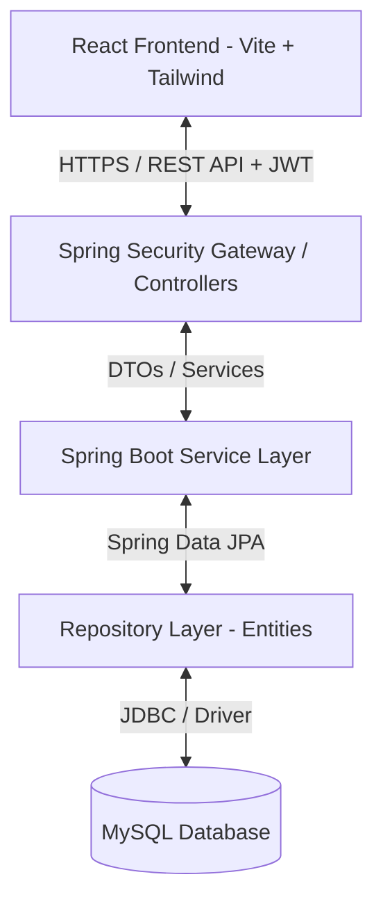
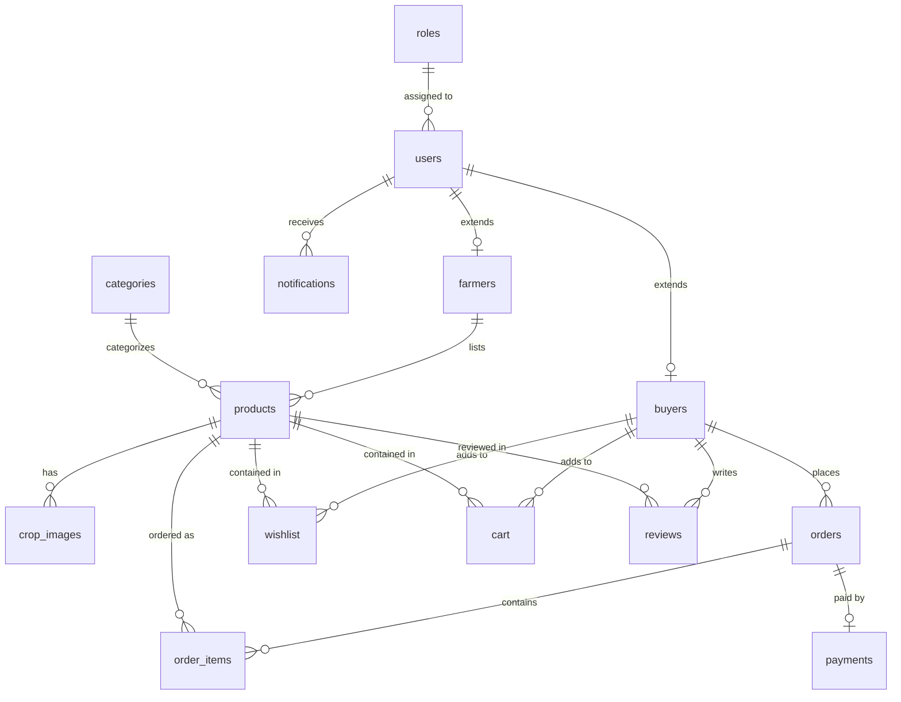

# AgriConnect – Farmer Marketplace

AgriConnect is an Industry-Based MCA Final Year Major Project designed as a decoupled client-server Web Application. The platform empowers farmers by connecting them directly with consumers, wholesalers, and retail buyers, eliminating intermediate brokers. 

This repository contains the architecture, database schema, API design, and initial project setups for **Phase 1**.

---

## 🚀 Tech Stack

### Frontend (Client)
*   **React.js (Vite)**: Standard Single Page Application (SPA) container for fast development and asset bundling.
*   **Tailwind CSS**: Utility-first CSS framework for custom responsive styling.
*   **React Router DOM**: Declarative client-side routing and protected routing guards.
*   **Axios**: Promise-based HTTP client for API communications with backend endpoint interceptors.

### Backend (Server)
*   **Java Spring Boot (v3.2.5)**: Production-ready enterprise backend container.
*   **Spring Security**: Role-based endpoint authorization.
*   **Spring Data JPA**: Hibernate-backed persistence layer.
*   **JWT Authentication**: Stateless session tokens for secure resource requests.
*   **Maven**: Dependency resolution and build engine.

### Database
*   **MySQL (v8.0+)**: Relational Database Management System storing data with complete foreign key constraints.

---

## 🏛️ System Architecture

AgriConnect uses a classic decoupled N-tier architecture.



*   **Presentation Layer**: A component-driven SPA interface that queries resources asynchronously and stores security state in-memory (using React Context).
*   **API Security / Controller Layer**: Receives HTTP requests, validates inputs (`@Valid`), extracts and verifies JWT bearer tokens, and maps payloads to Data Transfer Objects (DTOs).
*   **Service Layer**: Handles core transactions, validation rules, business logic boundaries, and entity-DTO conversions.
*   **Data Access Layer**: Repositories extending Spring Data's `JpaRepository` interface to execute optimized SQL queries.
*   **Storage Layer**: A persistent relational MySQL database structure.

---

## 📂 Project Directory Structure

```
f:\React\AgriConnect\
├── schema.sql                   # MySQL database creation script
│
├── agriconnect-frontend/        # React Frontend Application
│   ├── public/                  # Static public assets
│   ├── src/
│   │   ├── assets/              # Images, SVG icons, and media files
│   │   ├── components/          # Reusable UI components (Buttons, Modals, Form inputs)
│   │   ├── context/             # Global contexts (Auth, Cart, Notifications)
│   │   ├── hooks/               # Custom React hooks (useAuth, useCart)
│   │   ├── layouts/             # Shared page templates (Dashboard layout, Auth layout)
│   │   ├── pages/               # Page view components (skeleton endpoints)
│   │   ├── router/              # Router configs and Guarded/Protected route paths
│   │   ├── services/            # Axios API config wrappers and endpoint functions
│   │   ├── utils/               # Formatting, date parsing, helper functions
│   │   ├── App.jsx              # Main App wrapper component
│   │   ├── index.css            # Tailwind directives
│   │   └── main.jsx             # React DOM mount loader
│   ├── .gitignore               # Frontend version control ignore settings
│   ├── index.html               # Main single page DOM layout
│   ├── package.json             # Scripts and packages manifest
│   ├── postcss.config.js        # PostCSS configuration
│   ├── tailwind.config.js       # Tailwind CSS theme configuration
│   └── vite.config.js           # Vite server & proxy configuration
│
└── agriconnect-backend/         # Spring Boot Maven Backend
    ├── pom.xml                  # Maven dependency manifest
    ├── .gitignore               # Backend version control ignore settings
    └── src/
        ├── main/
        │   ├── java/com/agriconnect/
        │   │   ├── config/      # CORS, Bean initializers, MVC setups
        │   │   ├── controller/  # REST APIs mapping logic
        │   │   ├── dto/         # Request and Response payloads
        │   │   ├── entity/      # JPA Hibernate entities
        │   │   ├── exception/   # Global Exception Handler and API exceptions
        │   │   ├── repository/  # Spring Data JPA DB interfaces
        │   │   ├── security/    # JWT token filters, PasswordEncoder, UserDetailsService
        │   │   ├── service/     # Business logic layers & interfaces
        │   │   └── AgriConnectApplication.java # Spring Boot bootstrapper
        │   └── resources/
        │       ├── application.properties # Main application properties config
        │       └── db/migration/  # DB migration scripts (Optional)
        └── test/                # Unit & Integration test modules
```

---

## 🗄️ Database Design

We configure **15 tables** inside the schema. Auto-generation fields are mapped to `BIGINT` keys to support scalability, and audits fields (`created_at`, `updated_at`) are attached to all profile and transactional records.

### Entity Relationship (ER) Diagram



### Table Definitions:
1.  **`roles`**: Defines privileges (`ROLE_ADMIN`, `ROLE_FARMER`, `ROLE_BUYER`).
2.  **`users`**: General account credentials (emails, hash passwords, phone details, active statuses).
3.  **`farmers`**: Extended profiles containing farms names, sizes, crop license certifications, and UPI identifiers.
4.  **`buyers`**: Extended profile containing shipping metrics, corporate names, and GST numbers.
5.  **`categories`**: General category directories (e.g. Grains, Vegetables, Fruits).
6.  **`products`**: Available crop listings detailing prices, measurement metrics (kg, ton, bag), quantities, and harvesting date records.
7.  **`crop_images`**: Multi-image support references for product listings.
8.  **`orders`**: Buyer purchase checkouts with pricing tallies and shipping addresses.
9.  **`order_items`**: Relational bridge recording quantity snapshots and transaction price histories.
10. **`payments`**: Payment transaction logs tracking methods (UPI, Cards, Cash On Delivery) and gateway references.
11. **`wishlist`**: Saved items logs for buyers.
12. **`cart`**: Transient shopping carts storing product IDs and targeted purchase quantities.
13. **`reviews`**: Five-star rating feedback logs posted by buyers for specific products.
14. **`notifications`**: Contextual status warnings and system alerts (unread/read flags) sent to users.

*The full implementation schema script is located at [schema.sql](file:///f:/React/AgriConnect/schema.sql).*

---

## 📡 REST API Specifications

The server publishes all endpoints under `/api`. Endpoints marked with 🔒 require an `Authorization` header containing `Bearer <JWT_TOKEN>`.

### 1. Authentication & Profiles
*   `POST /api/auth/register` (Public) - Create user account.
*   `POST /api/auth/login` (Public) - Authenticate user, return details and JWT.
*   `GET /api/users/profile` (🔒) - Get logged-in user profile.
*   `PUT /api/farmers/profile` (🔒 Farmer) - Save farm and UPI configurations.
*   `PUT /api/buyers/profile` (🔒 Buyer) - Save corporate GST and shipping parameters.

### 2. Product Catalog
*   `GET /api/categories` (Public) - List all crop categories.
*   `POST /api/categories` (🔒 Admin) - Add new category catalog.
*   `GET /api/products` (Public) - Search & filter listings (paginated, filter by price, distance, crop type).
*   `GET /api/products/{id}` (Public) - Get full details of a specific crop listing.
*   `POST /api/products` (🔒 Farmer) - Post a new crop list.
*   `PUT /api/products/{id}` (🔒 Farmer) - Modify stock quantities or pricing.
*   `DELETE /api/products/{id}` (🔒 Farmer/Admin) - Soft archive crop listing.
*   `POST /api/products/{id}/images` (🔒 Farmer) - Upload multiple image files.

### 3. Shopping Cart & Wishlists (🔒 Buyer)
*   `GET /api/cart` - View items currently in cart.
*   `POST /api/cart` - Add crop item to cart.
*   `PUT /api/cart/{cartItemId}` - Modify target quantity.
*   `DELETE /api/cart/{cartItemId}` - Remove item.
*   `DELETE /api/cart/clear` - Purge cart entries.
*   `GET /api/wishlist` - View bookmarked crop listings.
*   `POST /api/wishlist` - Toggle crop item addition/removal.

### 4. Orders & Transaction Checks
*   `POST /api/orders` (🔒 Buyer) - Checkout cart to place order.
*   `GET /api/orders/{id}` (🔒) - Retrieve order receipt details.
*   `GET /api/orders/buyer` (🔒 Buyer) - Fetch personal order history list.
*   `GET /api/orders/farmer` (🔒 Farmer) - View incoming purchase orders for crops.
*   `PUT /api/orders/{id}/status` (🔒 Farmer/Admin) - Advance order state (`CONFIRMED`, `SHIPPED`, `DELIVERED`, `CANCELLED`).
*   `POST /api/payments/process` (🔒 Buyer) - Submit payment mock authorization tokens.

### 5. Social & Alerts
*   `POST /api/reviews` (🔒 Buyer) - Post rating (1-5) and feedback for a purchased crop.
*   `GET /api/products/{productId}/reviews` (Public) - Retrieve ratings for a crop.
*   `GET /api/notifications` (🔒) - List account system alerts.
*   `PUT /api/notifications/{id}/read` (🔒) - Dismiss notifications as read.

---

## 🛠️ Complete Installation & Setup Guide

### Prerequisites
*   **Java JDK 17** or above.
*   **Node.js** (v18.x or above) and **npm** (v9.x or above).
*   **MySQL Server** (v8.0+).
*   **Apache Maven** (Optional; project uses Maven wrapper).

---

### Step 1: Database Setup
1.  Open your MySQL Command Line Client or utility tools (e.g. MySQL Workbench, DBeaver).
2.  Log in to your server and run the script inside [schema.sql](file:///f:/React/AgriConnect/schema.sql):
    ```sql
    SOURCE f:/React/AgriConnect/schema.sql;
    ```
3.  Verify the tables have been created:
    ```sql
    USE agriconnect_db;
    SHOW TABLES;
    ```

---

### Step 2: Backend Configuration & Boot
1.  Navigate to the backend folder:
    ```bash
    cd agriconnect-backend
    ```
2.  Open [application.properties](file:///f:/React/AgriConnect/agriconnect-backend/src/main/resources/application.properties) and update the datasource credentials:
    ```properties
    spring.datasource.username=your_mysql_username
    spring.datasource.password=your_mysql_password
    ```
3.  Install and build the application packages:
    ```bash
    mvn clean compile
    ```
4.  Run the application server:
    ```bash
    mvn spring-boot:run
    ```
    *The server will boot and listen on port `8080`.*

---

### Step 3: Frontend Installation & Launch
1.  Navigate to the frontend folder:
    ```bash
    cd agriconnect-frontend
    ```
2.  Install dependencies:
    ```bash
    npm install
    ```
3.  Start the local Vite development server:
    ```bash
    npm run dev
    ```
4.  Open your browser and navigate to the address displayed in the console (normally `http://localhost:5173`).
