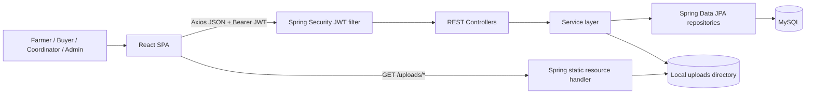
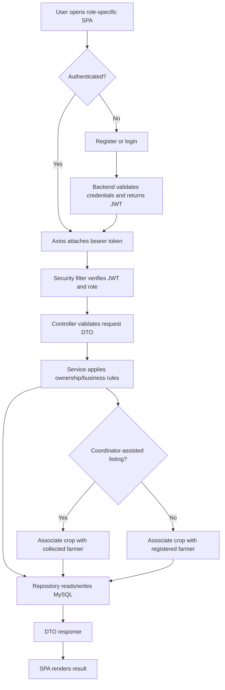

# Research Paper Project Analysis

**Project Name:** AgriConnect  
**Suggested Paper Title:** *AgriConnect: A Role-Based Agricultural Marketplace with Coordinator-Assisted Farmer Listings*  
**Research Domain:** Agricultural information systems; web software engineering; digital marketplace design  
**Analysis Date:** 4 October 2026  
**Repository:** `F:\React\AgriConnect` (active application: root-level `agriconnect-frontend/` and `agriconnect-backend/`)

> **Evidence convention.** “Verified” means visible in the active source/configuration or reported with a location in repository documentation. “Interpretation” is an architecture or research framing inferred from those facts. “Author input” means the repository does not establish the answer. The current repository contains contradictory/stale artifacts; see §18. Do not cite the older nested `agriConnect/` prototype or root `schema.sql` as the active system schema.

## 1. Project Identification

### 1.1 Name and titles

- **Official project name (repository/docs):** AgriConnect.
- **Suggested title:** *AgriConnect: A Role-Based Agricultural Marketplace with Coordinator-Assisted Farmer Listings*.
- **Alternatives:**
  1. *Design and Implementation of a Digital Crop Marketplace with Field-Coordinator Support*
  2. *A Role-Aware Web Platform for Agricultural Listing, Discovery, and Order Management*
  3. *Preserving Farmer Attribution in Direct and Coordinator-Assisted Digital Marketplaces*
  4. *AgriConnect: A Client–Server System for Crop Discovery and Agricultural Trade Workflows*

The titles describe implementation scope. Novelty and impact claims need literature review and empirical evidence.

### 1.2 Type, description, and domain

AgriConnect is a **web application / client–server software system** for agricultural crop listings and marketplace workflows. It has user roles (farmer, buyer, middleman/field coordinator, administrator), listing and marketplace views, cart/order/review/notification functions, and a coordinator-assisted farmer-record/listing path. The frontend is a React SPA and the backend is a Spring Boot REST service backed by MySQL. It is **not evidenced as an AI/ML, IoT, computer-vision, NLP, or blockchain system**: no model, training pipeline, dataset, sensor interface, or such algorithm was found in the active source inventory.

**One-line description:** A role-aware agricultural marketplace that supports direct farmer listings and coordinator-entered farmer/listing records, with browsing, ordering, market-reference prices, and account-scoped workflows.

**Research domain (interpretation):** digital agriculture/e-agriculture, agricultural e-commerce and market information systems, web application architecture, role-based access control, and human-computer interaction. A field study would additionally involve digital inclusion and technology adoption.

## 2. Research Contribution and Problem

### 2.1 What the implementation contributes

**Verified contribution candidates (system engineering):**

1. A decoupled React–Spring REST application implementing role-specific pages and server-side role authorization.
2. Two listing ownership paths: a crop can reference a registered farmer account or a coordinator-collected farmer record. Marketplace/order DTOs retain a resolved seller identity/type for attribution.
3. Account-scoped CRUD patterns for listings and collected-farmer records, plus marketplace discovery and commerce workflows (cart, orders, status, reviews, notifications).
4. A relational implementation using JPA entities/repositories and persisted user, crop, order, and operational records.

These are implementation contributions, **not demonstrated research novelty**. The repository gives no comparison proving novelty over prior platforms.

### 2.2 Problem framing

**Repository-supported motivation:** AgriConnect is intended to connect agricultural sellers and buyers through digital crop listings, and it has a coordinator workflow for recording farmers who do not directly create an account/listing. The README describes reducing reliance on intermediaries, but this is a project motivation, not a measured result.

**Research interpretation:** Marketplace systems that assume every producer directly operates a digital account may not represent assisted listing workflows. Such systems must also preserve who the represented farmer is while restricting coordinators to their own records. The concrete software problem addressed is how to represent, manage, discover, and transact against direct and coordinator-assisted crop listings with role- and owner-scoped access.

**Stakeholders:** farmers, buyers, field coordinators/middlemen, and administrators. Costs of the underlying market problem, affected population, connectivity constraints, and real stakeholder needs are not established by this repository.

**Formal problem statement:** Given users with distinct roles, crop listing records, and optional coordinator-collected farmer profiles, design and implement a web system that permits authorized users to create and manage their own relevant records, makes available listings discoverable to marketplace users, and preserves seller attribution through cart/order records. The present repository establishes software behavior; whether it improves access, usability, prices, participation, or welfare remains an empirical question.

### 2.3 Objectives

**Primary objective (inferred):** implement a role-based agricultural marketplace for listing, finding, and ordering crops, including assisted listing by a field coordinator.

**Secondary objectives (inferred from source):**

1. Authenticate accounts and restrict operations by role and record ownership.
2. Let farmers create, view, edit, and delete their crop listings.
3. Let buyers browse available listings, maintain a cart, place/track orders, and review sellers.
4. Let coordinators manage collected farmer records and associated listings while retaining attribution.
5. Provide market-price reference records and administrative account/listing views.

The objectives are inferred from implementation; the original approved requirements and exact research motivation are **Not available in the project repository — requires author input.**

### 2.4 Research questions and hypothesis

These are testable proposals, not claims already answered by the code:

- **RQ1:** Does the system preserve correct seller attribution from direct and coordinator-assisted crop listing through marketplace display and order creation?
- **RQ2:** Do role and owner checks prevent unauthorized access or mutation across farmer, buyer, coordinator, and administrator workflows?
- **RQ3:** How do farmers and coordinators complete representative listing/discovery tasks, measured by completion, time, errors, and a declared usability instrument?
- **RQ4:** In a defined field setting, what operational differences (if any) does the assisted flow produce relative to the existing workflow or a direct-entry comparison?

**Hypothesis:** no outcome hypothesis is justified by repository evidence. A suitable pre-registered hypothesis could concern correct attribution or task performance, but requires a protocol, baseline, and participants.

## 3. Existing and Related Approaches

The repository does not describe or benchmark a named incumbent workflow. Conventional possibilities to investigate include in-person market transactions, trader/agent-mediated matching, and digital agricultural market platforms. Their prevalence and limitations in the intended study area require citations and author/context confirmation.

Relevant literature indicates that electronic agricultural markets can have context-dependent impacts: the eNAM study discusses adoption, price effects and operational bottlenecks; an empirical study of Indian agricultural e-marketplaces reports that transaction costs did not significantly fall in its studied context. These findings motivate careful local evaluation; they are not evidence about AgriConnect. See Reddy and Mehjabeen’s study in *IIM Kozhikode Society & Management Review* ([publisher record](https://journals.sagepub.com/doi/10.1177/2277975218807277)) and Argade, Laha, and Jaiswal’s study in *Electronic Markets* ([record and DOI](https://ideas.repec.org/a/spr/elmark/v32y2022i3d10.1007_s12525-022-00539-x.html)).

**Related-work search keywords (use combinations, document databases/date/criteria):**

1. agricultural digital marketplace smallholder farmers India
2. farmer-to-buyer e-commerce agricultural produce
3. digital agricultural market platform market access
4. eNAM farmer participation adoption barriers
5. agricultural market information systems typology
6. field agent assisted digital services agriculture
7. extension worker digital platform farmer market linkage
8. assisted digital inclusion rural agriculture
9. agricultural e-market transaction costs empirical study
10. farmer price realization digital marketplace causal evaluation
11. agricultural supply chain platform seller attribution
12. role-based access control multi-role marketplace application
13. rural agricultural application usability field study
14. farmer mobile technology adoption low connectivity
15. digital platforms agricultural marketing India review
16. smallholder market channel choice communication networks

Literature review should establish the research gap rather than claim this system is first or superior.

## 4. Proposed System and Architecture

### 4.1 System concept and data flow

The browser-based React SPA presents role-specific views and calls JSON REST endpoints through Axios. An Axios request interceptor attaches a bearer JWT read from browser local storage. Spring Security’s stateless filter chain validates bearer tokens; controllers call service-layer business logic; Spring Data JPA repositories persist entities in MySQL. A coordinator can create a `CollectedFarmer` record and associate crops with it; a registered farmer creates crops associated with their `User` record. Marketplace mapping resolves the display seller and available status. Cart and order services snapshot purchase details; orders then expose status, seller-facing views, and related notifications/reviews. Coordinator crop image uploads are stored under a local `uploads` path and served as static resources. Vite proxies `/api` and `/uploads` to the backend during development.

**Input:** registration/profile, crop/listing fields, searches/filters, cart quantities, checkout/address/note, order-status actions, review data, coordinator-collected farmer data, and admin-maintained market prices.  
**Processing:** validation, authentication/authorization, owner scoping, CRUD/query operations, listing availability filters, totals/snapshots, DTO mapping.  
**Output:** page data, API response DTOs, order state, notifications/reviews, and uploaded image URL.  
**External service:** none required by source for core operation; no payment gateway, geocoding provider, or external live price feed was found. Market prices are manually maintained/seeded, per `MarketPrice` source comments.

### 4.2 Architecture classification

**Interpretation:** a layered client–server, three-tier-style architecture (presentation SPA; REST/controller and service logic; persistence/repository and relational database), deployed as a single Spring Boot backend rather than microservices. The feature flow is request/response, not event-stream or ML-pipeline based. Runtime hosting topology is not established. Development Vite proxy is evidenced in `vite.config.js`.

| Component | Technology | Purpose | Input | Output |
|---|---|---|---|---|
| Web UI | React 18, React Router, Tailwind | Login and role-specific marketplace/workflow pages | User interaction, API data | Forms, listings, order/account views |
| API client | Axios | REST requests and bearer header | UI requests, local token | HTTP response/error |
| API/security | Spring Boot Web, Spring Security, JWT | REST endpoints and stateless authentication/authority checks | HTTP request and JWT | Authorized controller invocation / response |
| Business services | Java/Spring services | Validation, ownership, order/cart/review logic and mapping | DTOs, principal | DTOs / entity mutations |
| Persistence | Spring Data JPA/Hibernate, MySQL Connector/J | Entity queries and persistence | Entities/query parameters | Rows/entities |
| Database | MySQL | Durable user/listing/order and related data | SQL through JPA | Persisted records |
| Image serving | Local filesystem + Spring static resource handler | Store/serve coordinator-uploaded images | Multipart file/path | `/uploads/...` URL and bytes |
| Dev asset/build server | Vite | Frontend development and API proxy | Source and browser requests | SPA bundle/dev proxy |

### 4.3 Architecture diagram



### 4.4 Complete high-level flow

1. User registers or logs in; backend hashes passwords with BCrypt and issues a signed JWT on successful authentication.
2. Frontend stores token and user response in `localStorage`; subsequent Axios calls attach bearer token.
3. Backend authenticates token, applies URL/authority rules, and resolves current principal.
4. Controller validates request DTO and delegates to a service.
5. Service applies role/ownership rules and uses repository operations against JPA entities.
6. Marketplace queries available crops and maps seller identity from farmer or collected-farmer relationship.
7. Buyer may add available crops to a cart and place an order; order items preserve crop/seller/price fields as snapshots; status changes can create persisted notifications.
8. Frontend renders response data and supports subsequent actions.

## 5. Technology Stack

Versions below are manifest-declared versions/ranges, not independently resolved runtime versions unless stated.

| Layer | Technology | Version | Purpose |
|---|---|---|---|
| Frontend | React / React DOM | `^18.3.1` | SPA UI |
| Frontend | Vite, React plugin | `^5.2.11`, `^4.3.0` | Development/build |
| Frontend | React Router DOM | `^6.23.1` | Client routing |
| Frontend | Axios | `^1.6.8` | HTTP client |
| Frontend styling/icons | Tailwind CSS, PostCSS, Autoprefixer, lucide-react | `^3.4.3`, `^8.4.38`, `^10.4.19`, `^0.378.0` | Styling/icons |
| Backend | Java | 17 target in Maven | Backend language/runtime target |
| Backend | Spring Boot | 3.2.5 | Application framework |
| Backend | Spring Web, Security, Data JPA, Validation | Boot-managed | REST, authorization, persistence, DTO validation |
| Database | MySQL Connector/J | Boot-managed | JDBC driver; DB configured as MySQL |
| Auth | JJWT | 0.11.5 | HS256 JWT creation/parsing |
| ORM | Hibernate/JPA | Boot-managed | Object-relational mapping |
| Other | Lombok | 1.18.32 | Java boilerplate generation |
| Build | Maven | Wrapper/runtime version not found | Backend build/dependency management |
| Build | npm/package-lock, Vite | lockfile present | Frontend dependency install/build |
| Testing | JUnit/Spring Boot Test/Spring Security Test | Boot-managed | Backend unit/security tests |
| Deployment | Not identified | — | No deployment manifest or production topology found |

No active AI/ML library, training tool, external API integration, frontend automated-test framework, or CI deployment workflow was established by the inspected active manifests.

## 6. Data and Preprocessing

### 6.1 Repository data

There is **no research dataset or model training corpus** in the active project inventory. The application persists operational records: users/roles, crops, collected farmers, cart items, orders/order items, market prices, reviews, and notifications. The root SQL file defines a separate/stale schema with additional planned entities; it is not the current JPA model.

| Dataset field | Finding |
|---|---|
| Dataset name/source/type/count | Not available in the project repository — requires author input. No experimental dataset found. |
| Application records/samples | Runtime row counts not inspected; no production/seed study dataset found. |
| Features / labels | Operational fields only; no supervised labels or ML features/pipeline. |
| Format / collection | Relational records via API; coordinator collection form captures farmer/location/agricultural profile fields. Actual collection protocol and consent are undocumented. |
| Split, augmentation, normalization, missing data | No train/validation/test split, augmentation or ML preprocessing found. DTO validation enforces some required/length/numeric constraints; nullable entity fields remain possible. |
| Privacy / license | No dataset license or ethics/consent protocol found. Collected farmer records include phone and location; data minimization, retention, notice, and access policy need author/security review. |

### 6.2 Preprocessing steps actually present

| Input | Operation | Reason supported by implementation | Output |
|---|---|---|---|
| Registration/crop/coordinator/review DTO | Bean Validation constraints (`@NotBlank`, `@Size`, numeric minima, email format, etc.) | Reject malformed/incomplete request data | Valid DTO or validation error response |
| Crop listings | Query `available=true` for marketplace list/detail/contact | Restrict discovery/contact to available listing | Available crop entities/DTOs |
| Marketplace/coordinator search text | Case-insensitive string filtering (marketplace name/category/location filtering is client-side; market price search is repository-side) | Narrow displayed/query results | Filtered list |
| Buyer cart/order | Price/name/seller/location snapshots and `BigDecimal` arithmetic | Retain transaction-time values | Cart/order line records and totals |
| Image upload | MIME-reported type check and multipart size limit documented in status/config | Reject unsupported/oversized upload | Saved file path/URL (persistent end-to-end upload remains unverified) |

No image transformation, statistical cleaning, feature scaling, or model-specific preprocessing was found.

## 7. Algorithms, Models, and Mathematical Formulation

### 7.1 Computational techniques

| Name | Purpose/input/output | Parameters/training/inference | Complexity / limits |
|---|---|---|---|
| JWT validation (JJWT HS256) | Verify signature/expiry and match subject username to loaded user; request header to authenticated principal | Secret is Base64; expiration configured as 86,400,000 ms. No training. | Token parsing is bounded by token length; DB/user lookup also contributes request cost. Key provisioning/rotation policy is author/deployment input. |
| BCrypt password encoder | Hash and verify submitted password | BCrypt defaults; cost factor not overridden in source. No training. | Deliberately computational per password; benchmark configuration not reported. |
| Role/owner checks | Restrict route by role and service/repository lookup by account/owner | Fixed role authorities and authenticated principal | Indexed lookup behavior depends on generated schema/indexes; no benchmark. |
| Marketplace filters | Crop-name/category/location matching, largely client-side | User filter strings | For (n) loaded crops and string comparison cost (k), approximately (O(nk)) client scan; results are bounded by backend list behavior, not paginated in evidence reviewed. |
| Order total | Sum quantity × unit price over order lines using `BigDecimal` | Decimal line values | (O(m)) for (m) lines; transactional correctness/concurrency tests needed. |
| Data snapshots / seller key | Persist order fields; review uniqueness discriminator by seller type/id | `FARMER:id` or `COLLECTED_FARMER:id` | Constant-time string construction; intended to preserve attribution/uniqueness semantics. |

**ML/deep learning fields:** architecture, layers, activations, loss, optimizer, learning rate, epochs, batch size, training data, pretrained weights and ML evaluation metrics are **not applicable / not found**. No model file, training script or inference pipeline was found.

### 7.2 Mathematical formulation

The code supports a simple transaction calculation, not a predictive model. For order lines (i=1,ldots,m), quantity (q_i), and snapshot unit price (p_i):

\[
T = \sum_{i=1}^{m} q_i p_i.
\]

The repository provides no empirically estimated objective/loss function, probability model, ranking/similarity function, or evaluation formula. Do not add such equations to imply machine learning or measured optimization.

## 8. Methodology and Workflow

### 8.1 Methodology summary

The implemented method is conventional web application processing: acquire a browser request; authenticate/authorize; validate a DTO; apply business and ownership logic; query/update relational entities; map a response; render it in the SPA. This is an implementation description, not an experiment design.

### 8.2 Reproducible software workflow

1. Run MySQL and provision the active JPA-compatible database/schema; supply DB password and JWT secret through the documented environment/configuration.
2. Start Spring Boot backend (default port 8080).
3. Start Vite frontend (port 5173); development proxy routes `/api` and `/uploads` to backend.
4. Register/login and obtain JWT; verify profile request.
5. As farmer, submit validated crop DTO; service associates record with authenticated account.
6. As coordinator, create collected-farmer record; optionally link an account; create crop associated with that record.
7. As marketplace role, query available crops; UI filters by name/category/location and displays resolved seller.
8. As buyer, add listing to cart, place order, inspect order; seller roles update allowed status; notification/review workflows operate on persisted records.
9. Capture functional/security outcomes and performance/user-study measurements using a separately declared research protocol before making effectiveness claims.

### 8.3 Workflow diagram



## 9. Diagrams Recommended for the Paper

| Diagram | Purpose / caption | Mermaid-compatible definition |
|---|---|---|
| System architecture | Show client/API/security/service/persistence and upload path. Caption: “AgriConnect client–server architecture and persistence flow.” | Use §4.3. |
| Listing workflow / activity | Contrast direct and assisted listing, then marketplace display. | Use §8.3. |
| Data model / ER | Show entities and optional ownership paths. Caption: “Core relational model for accounts, crop listings, assisted farmer records, and transactions.” | ```mermaid\nerDiagram\n ROLE ||--o{ USER : grants\n USER ||--o{ CROP : owns_directly\n USER ||--o{ COLLECTED_FARMER : records\n USER ||--o{ COLLECTED_FARMER : may_link\n COLLECTED_FARMER ||--o{ CROP : represents\n USER ||--o{ CART_ITEM : owns\n CROP o|--o{ CART_ITEM : references\n USER ||--o{ ORDER : places\n ORDER ||--|{ ORDER_ITEM : contains\n CROP o|--o{ ORDER_ITEM : snapshot_source\n ORDER ||--o{ REVIEW : reviewed_order\n USER ||--o{ REVIEW : authors\n USER ||--o{ NOTIFICATION : receives\n``` Actual FK/uniqueness details should be generated from JPA/current DB, because root SQL is stale. |
| Sequence: login/protected request | Explain token issuance and resource access. | ```mermaid\nsequenceDiagram\n participant B as Browser\n participant A as AuthController/AuthService\n participant DB as MySQL\n participant S as Spring Security\n participant C as ResourceController\n B->>A: POST login credentials\n A->>DB: load account/role\n DB-->>A: account\n A-->>B: JWT + profile DTO\n B->>S: request + Bearer JWT\n S->>DB: load user details\n S-->>C: authenticated principal\n C-->>B: resource DTO\n``` |
| Deployment | Show browser, Vite dev server, API server, DB, local image path. Production nodes are unknown; caption must say development topology. | `flowchart LR; Browser --> Vite; Vite --> SpringBoot; SpringBoot --> MySQL; SpringBoot --> Uploads[(local uploads)]` |
| Use case | Roles and implemented tasks. Create only after confirming exact paper scope; see role list and routes in §10. | Draw from role × operation matrix; avoid implying all roles share all endpoints. |
| Experimental setup/results | Required only after evaluation. | Not derivable from code; author/researcher must prepare from actual experiment. |

PlantUML is optional; the Mermaid definitions above suffice for these static figures. A security/threat diagram is appropriate if security is an evaluated contribution. A model architecture diagram is not applicable.

## 10. Implementation Details

### 10.1 Repository structure and important files

| File/module | Responsibility / important elements |
|---|---|
| `agriconnect-frontend/src/App.jsx` | Client routes and role guards |
| `src/context/AuthContext.jsx` | Login/register/current-user state and profile revalidation |
| `src/services/api.js` | Axios client, bearer token, auth and feature service wrappers |
| `src/pages/Marketplace.jsx` | Available listing discovery and client-side name/category/location filters |
| `src/pages/{AddCrop,EditCrop,MyCrops}.jsx` | Farmer crop management |
| `src/pages/{CollectedFarmers,MiddlemanDashboard}.jsx`, `src/components/Middleman*.jsx` | Coordinator-assisted farmer/listing flows |
| `src/pages/{Cart,MyOrders,OrderDetails,FarmerOrders,CoordinatorOrders}.jsx` | Cart and role-specific order flows |
| `src/pages/{MarketPrices,AdminMarketPrices}.jsx` | Market price browsing/admin maintenance |
| `src/pages/{AdminDashboard,AdminUserDetails,AdminCropDetails}.jsx` | Admin overview (read-only API surface per docs/source) |
| `agriconnect-backend/pom.xml` | Java/dependency versions and Maven build |
| `src/main/resources/application.properties` | MySQL, JPA, JWT expiry, file size, server settings |
| `controller/` | REST endpoint mappings for auth, crops, marketplace, middleman, cart, order, review, market price, notification, contact, dashboard/admin |
| `service/` | Business logic for auth, crop, collected farmer, cart, order, review, notification, market price, contact, dashboards, admin |
| `repository/` | Spring Data JPA queries including owner-scoped and available crop reads |
| `entity/` | `User`, `Role`, `Crop`, `CollectedFarmer`, `CartItem`, `Order`, `OrderItem`, `Review`, `MarketPrice`, `Notification` |
| `security/`, `config/`, `util/JwtUtil.java` | JWT filter/user details, access rules, password encoder, static uploads, bootstrap/reset runners |
| `src/test/java/` | 20 test source files are present (8 controller-security/auth test files and 12 service test files, based on repository inventory); test execution state varies by documentation snapshot |
| `schema.sql` | Legacy/planned schema; does not match current active JPA schema |
| `agriConnect/` | Nested older prototype with separate frontend/backend; not the root README’s active paths |

### 10.2 API surface (representative; verify exact mappings before publication)

| Feature | Active routes evidenced in controllers |
|---|---|
| Auth/profile | `/api/auth/register`, `/login`, `/profile` (GET/PUT) |
| Farmer crops/dashboard | `/api/farmer/crops` (CRUD); `/api/farmer/dashboard/sales` |
| Marketplace/contact | `/api/marketplace/crops` (GET list/detail); `/api/contact/crop/{cropId}` |
| Coordinator | `/api/middleman/farmers` CRUD/search/stats/link/unlink; nested farmer crops; crop update/delete; `/crops/upload-image` |
| Cart | `/api/cart`, `/items`, `/items/{itemId}` |
| Orders | `/api/orders`, buyer detail/list, `/received`, `/coordinator`, status update; exact HTTP verbs are in `OrderController.java` |
| Reviews | `/api/reviews`, `/mine`, `/order/{orderId}/targets`, received farmer/collected-farmer summaries |
| Market prices | Public-to-authorized market listing `/api/marketplace/market-prices`; admin create/update/delete `/api/admin/market-prices` |
| Notifications | `/api/notifications`, unread count, mark-one/read-all |
| Admin | `/api/admin/dashboard`, `/users`, `/crops` |

This is a route inventory, not a complete OpenAPI specification. No OpenAPI/Swagger document was found.

### 10.3 Data model and configuration

Active Java entities contain ten entity classes listed above. `Crop.farmer` and `Crop.collectedFarmer` are nullable relations; source comments describe mutually exclusive ownership, but database constraints do not enforce “exactly one” owner. `OrderItem` stores snapshot values and references crop/seller where available. `CollectedFarmer` includes `collectedBy` and optional linked farmer. `MarketPrice` is a manually managed reference rate distinct from listing asking price.

Configuration found: port 8080; local MySQL URL `jdbc:mysql://localhost:3306/agriconnect_db`; user default `root`; password placeholder `AGRICONNECT_DB_PASSWORD`; JPA `ddl-auto=update`, SQL logging on; Base64 JWT secret `AGRICONNECT_JWT_SECRET`; token expiry 86,400,000 ms; upload request/file cap 5 MB. The status document reports the JWT key should decode to at least 32 bytes. Production values, hosting, TLS termination, backup, migrations, and secret rotation are not specified. No checked-in secret values should be copied into a paper.

## 11. Experimental Setup and Results

### 11.1 What is already available

No controlled experiment, participant study, benchmark, baseline, or outcome dataset is included. `docs/PROJECT_STATUS.md` and `docs/TESTING_PLAN.md` report prior verification, but their counts/status snapshots conflict (the status says 20 focused backend tests and frontend build passed, while the testing plan reports six tests; the present inventory has 20 test source files). This analysis did not execute tests or builds. Treat those as repository-reported historical checks until reproducibly rerun and reconciled.

| Item | Repository evidence |
|---|---|
| Hardware / OS | Not available in the project repository — requires author input. |
| Software | Maven declares Spring Boot 3.2.5 / Java 17 target; frontend manifest gives versions in §5. Exact runtime versions at evaluation: not available. |
| Dataset / split / sample count | No experiment dataset or split identified. Runtime fixture counts not given. |
| Procedure / runs / random seed | No research experiment procedure, repetitions, or seed documented. |
| Baselines / metrics | No baseline or measured performance/usability/economic metric established. |
| Functional checks | Historical status/testing docs report API checks for auth, role denial, farmer CRUD/ownership, coordinator records/listings, buyer marketplace attribution, admin denial and build/tests, with unverified/pending cases. See `docs/TESTING_PLAN.md`; counts and date snapshots require reconciliation. |

### 11.2 Actual results

**No scientific outcome or performance results are present.** The only numerical evidence in project documentation is test/build status and configuration limits; it must not be presented as model accuracy, farmer impact, marketplace performance, or user evaluation. In particular, no income, price realization, adoption, task-time, latency, throughput, or user-satisfaction result is available.

### 11.3 Experiments required before publication

1. **Reproducible functional tests:** document environment/DB fixtures and run API and UI flows, including both ownership paths, all status transitions, order snapshots, cart availability edge cases, review uniqueness, notification isolation, and admin role restrictions.
2. **Security tests:** anonymous and wrong-role matrix; cross-account read/write attempts; JWT expiry/signature/rotation; DTO response privacy; malicious/oversized upload and MIME/content validation; injection/XSS/CSRF/CORS/dependency review.
3. **Attribution correctness:** construct mixed direct/assisted orders and measure exact seller identity/type through listing, cart, checkout, history, seller dashboard and review summary.
4. **Performance/scalability:** define realistic corpus/concurrency, warm-up, hardware and environment; measure p50/p95/p99 API latency, throughput, errors, DB query counts, memory and upload behavior. Compare indexed/paginated alternatives only with fair repeated tests.
5. **Usability/field evaluation:** consented, ethics-approved recruitment of defined farmer/coordinator/buyer groups; representative tasks; completion/time/error measures and validated questionnaire; record device/network/language/accessibility context.
6. **Comparative study:** predeclare an existing workflow or relevant baseline. Claims about access, transaction cost, price or income require longitudinal/causal design and appropriate confounder handling.

## 12. Baselines and Ablations

No baseline comparison is implemented in the repository. Suitable baseline categories depend on research question: manual/current farmer-buyer discovery process; direct-only digital listing workflow; same platform with coordinator-assisted entry disabled; and alternative seller-attribution representation. Do not invent values or call a commercial service a baseline without a fair protocol.

Possible ablations (for functional/design evaluation):

- Disable coordinator-assisted records: measures how the assisted path changes task feasibility and participation; requires participant/data study.
- Remove owner-scoped filters: negative-control security test only, never deploy insecurely; illustrates need for isolation.
- Remove seller identity/type snapshots: test attribution stability after crop/profile changes/deletion.
- Replace client-side filters with server-side indexed/paginated queries: compare performance on a fixed corpus.
- Remove market-price reference view: usability comparison only; does not establish price outcome.
- Remove order/review workflow: assess task coverage/complexity, not market impact.

## 13. Performance, Security, Privacy, and Limitations

### 13.1 Performance and scalability

No measured latency, throughput, memory, or capacity evidence exists. Likely costs inferred from source: database CRUD/query cost plus serialization and browser network; client-side marketplace filtering is linear in the fetched crop count; order aggregation is linear in order-line count. Repository definitions must be checked for indexes, eager/lazy joins, N+1 query risk, pagination, and transaction locking before making scaling claims. `ddl-auto=update`, SQL display logging, single local upload directory, and one backend deployment configuration are not production capacity evidence.

### 13.2 Security and privacy

**Implemented in source:** stateless Spring Security; JWT bearer filter; BCrypt password encoder; authority restrictions for farmer/admin/middleman/marketplace/cart/order endpoints; protected account-scoped services; DTO validation annotations; public ADMIN registration rejection reported by tests/docs; generic error handling described in status docs; upload size configuration; upload MIME-reported type checks described in docs. Frontend token storage uses `localStorage` (verified in `src/services/api.js`).

**Risks/recommendations requiring review:** browser local storage exposes bearer tokens to successful same-origin script injection; use CSP/XSS defenses and consider secure HttpOnly cookie strategy after threat analysis. Ensure HTTPS in deployment. A MIME header can be spoofed; validate file signatures, generate safe names, and scan/limit dimensions where relevant. Confirm upload route exposure and content access policy. Define CORS, rate limiting, lockout, JWT key rotation, secret storage, audit logging, retention/deletion/consent for farmer contact/location records, and backup encryption. CSRF is disabled because API uses stateless bearer tokens; verify deployment/token transport assumptions. Source review alone is not a security audit.

### 13.3 Genuine limitations

- The codebase proves feature implementation, not adoption, usability, market efficiency, better prices, reduced intermediaries, income change, or farmer welfare.
- No research dataset, experiment protocol, metrics, baseline, user study, or production deployment evidence was found.
- Root README and SQL schema are stale and describe tables/routes that do not represent active JPA/API design; current `ddl-auto=update` is not a migration history.
- Nested `agriConnect/` is a separate older prototype, so the repository is ambiguous without an explicit canonical-project note.
- Crop owner XOR is a code-level intention, not a demonstrated database invariant; validate existing records and enforce exactly-one ownership.
- Documentation snapshots contradict each other on implemented commerce scope and test counts; route/source code indicates cart/order/review/notification/market-price modules exist, while status docs claim these are outside current implementation.
- Local filesystem image storage, absent production topology, and lack of automated frontend tests constrain reproducibility/deployment claims.
- Price records are manually maintained reference rates; source does not establish freshness, provenance, or accuracy.
- No evidence of offline support, localization coverage, accessibility evaluation, or low-bandwidth performance.

## 14. Future Work

Prioritize reconciling active scope/schema/docs; enforcing a single valid crop owner and adding DB migrations; publishing API/schema documentation; finishing end-to-end role/ownership/upload tests; paginating and server-filtering marketplace queries; hardening upload and secrets/deployment; validating market-price provenance/timestamps; and conducting consented, representative usability and field studies. Only after those steps consider multilingual/low-bandwidth support, mobile clients, hosted object storage, external payment or market-data services, and geographically broader validation. ML recommendation or price forecasting would be a separate future system requiring data, model evaluation, and a distinct research question.

## 15. Reproducibility Checklist

| Item | Status | Basis |
|---|---|---|
| Source code available | AVAILABLE (within this repository) | Active frontend/backend source is present |
| Dataset available | MISSING | No research dataset found |
| Dataset preprocessing documented | MISSING / not applicable to current software study | No ML/data experiment |
| Dependencies documented | PARTIALLY AVAILABLE | Maven POM, npm manifest and lockfile; runtime versions still need recording |
| Environment documented | PARTIALLY AVAILABLE | Config docs exist; OS/hardware/provisioning not reproducibly specified |
| Hyperparameters documented | NOT APPLICABLE | No trained model |
| Training procedure documented | NOT APPLICABLE | No model training |
| Evaluation procedure documented | PARTIALLY AVAILABLE | Testing plan exists but gaps/count conflicts and study protocol absent |
| Random seed documented | NOT APPLICABLE / MISSING for any future statistical experiment | None found |
| Hardware documented | MISSING | None found |
| Experimental results available | MISSING | No research outcome/performance results |
| Baselines available | MISSING | None found |
| Configuration available | PARTIALLY AVAILABLE | Properties and Vite config; secrets are external and runtime config is incomplete |

## 16. IEEE Paper Structure Mapping

| IEEE section | Information available | Missing information |
|---|---|---|
| Title | Project name and implementation framing | Final author-approved title and novelty framing |
| Abstract | Background/problem framing, system concept, technologies | Validated results and final conclusion |
| Index Terms | Suggested in §17 | Author/venue preferences |
| I. Introduction | Intended marketplace and assisted-listing rationale | Evidence of problem scale, regional context, citations, motivation confirmation |
| II. Related Work | Search themes and initial peer-reviewed sources in §3/§18 | Systematic search strategy, synthesis, research gap |
| III. Problem Statement | Formal software problem in §2 | Stakeholder-confirmed scope and operational definitions |
| IV. Proposed Methodology | Implemented request/business/data flow | Research/evaluation methodology and reproducibility details |
| V. System Architecture | Layered architecture, Mermaid diagrams | Confirmed deployment topology and final figures |
| VI. Implementation | Stack, modules, endpoints, entities | Canonical repo/scope decision; migrations and deployment specifics |
| VII. Experimental Setup | Test plan and suggested studies | Hardware, environment, corpus, procedure, sample, runs, baseline |
| VIII. Results | Historical functional checks reported in docs, with caveats | Reconciled rerun logs; quantitative/system/user results |
| IX. Discussion | Expected interpretation topics | Observed results and comparison with literature |
| X. Limitations | §13.3 | Author-confirmed deployment/study limitations |
| XI. Conclusion | Safe implementation-level conclusion can be drafted | Outcome claims await experiments |
| Future Work | §14 | Prioritization/author confirmation |
| References | Two relevant peer-reviewed studies linked in §3 | Verified full bibliography, citation style, further primary papers |

## 17. Abstract Information and Keywords

| Abstract element | Supported information |
|---|---|
| Background | Digital marketplace software for agricultural crop discovery is the stated project context. |
| Problem | A digital workflow should support both direct farmer listings and coordinator-assisted representation while preserving ownership and seller attribution. This is an implementation framing; broader market problem needs citations. |
| Proposed solution | AgriConnect, a role-aware React/Spring/MySQL web marketplace. |
| Method | Implemented client–server architecture, JWT authentication, relational persistence, direct/assisted crop ownership paths, and commerce workflows. |
| Results | No research metrics/results are available. Repository docs report historical functional checks; test count/status conflict. Do not state performance or impact. |
| Contribution/conclusion | The artifact implements the stated workflows; effectiveness and novelty remain to be demonstrated. |

**Abstract drafting note:** write the abstract after reconciling source/document scope and running the declared evaluation. Do not use “improves,” “increases,” “reduces,” “efficient,” or “novel” as empirical conclusions absent evidence.

**Index Terms—** agricultural marketplace, digital agriculture, farmer–buyer connectivity, role-based access control, assisted digital services, web application.

## 18. Citation Requirements and Starting Literature

| Topic needing citation | Why | Suggested source type |
|---|---|---|
| eNAM / Indian agricultural market digitization | Context and prior platform findings; not evidence about this app | Peer-reviewed empirical/policy research and official government sources |
| Electronic agricultural markets and transaction costs | Frame comparison and avoid unsupported benefit assumptions | Primary empirical market/platform studies |
| Digital inclusion and field-agent/extension-mediated service | Motivate assisted listing pathway | Field studies and HCI/ICT4D research |
| JWT, BCrypt, Spring, React, JPA, MySQL | Identify standards/framework designs used | Official specifications/docs; cite only if required by venue |
| Usability instrument and security evaluation method | Justify measurement method | Original instrument/method papers and standards |

Initial literature pointers (verify full text, methods, scope, and IEEE bibliography metadata before final citation):

1. A. A. Reddy and Mehjabeen, “Electronic National Agricultural Markets, Impacts, Problems and Way Forward,” *IIM Kozhikode Society & Management Review*, 2019. [Publisher/DOI record](https://journals.sagepub.com/doi/10.1177/2277975218807277). The page identifies it as a research article and describes eNAM impacts and bottlenecks; use as contextual related work, not as a comparator for AgriConnect.
2. A. Argade, A. K. Laha, and A. K. Jaiswal, “Electronic marketplaces under conditions of oligopsony and relational marketing – an empirical exploration of electronic agricultural markets in India,” *Electronic Markets*, vol. 32, no. 3, pp. 1541–1554, 2022, DOI: 10.1007/s12525-022-00539-x. [Bibliographic record](https://ideas.repec.org/a/spr/elmark/v32y2022i3d10.1007_s12525-022-00539-x.html). This source reports its own study’s transaction-cost result; contextualize and verify against publisher full text.

This short web search is a starting point, not a systematic review. No literature-derived novelty claim is made here.

## 19. Author Input Required

The following are **Not available in the project repository — requires author input**:

- Author names, affiliations, corresponding author email, ORCIDs, acknowledgements, funding, and conflict declarations.
- Final canonical scope: whether this paper analyzes the root app and whether the nested `agriConnect/` prototype should be excluded formally.
- Confirmed research motivation, target users/region, requirements source, and intended operational definition of “direct” and “coordinator-assisted.”
- Whether coordinator is an intermediary, facilitator, extension worker, or another role; use precise terminology grounded in field practice.
- Actual operational dataset/row counts, data provenance, collection period, consent, permissions/license, anonymization and retention approach.
- Experimental results; hardware, OS, exact software/runtime versions; environment; repeat count; seeds where relevant; dataset/test fixtures; baseline and metrics.
- Usability/field-study sample, recruitment, protocol, instruments, consent/ethics approval, language, devices and network conditions.
- Deployment topology, production security controls, HTTPS/CORS configuration, backup/monitoring, image persistence policy, JWT key management and scaling assumptions.
- Market-price source, update cadence, units/market coverage, verification responsibility and historical completeness.
- Citation style/IEEE venue and any prior related publication or institutional paper requirements.
- Confirmation that reported historical tests/build checks correspond to the current repository revision; resolve six-vs-20 test-count documentation conflict.

## 20. Research Paper Readiness

**Score: 43/100 (analysis estimate, not a validated rubric).** The score reflects a substantial inspectable software artifact and architecture documentation, discounted for conflicting repository snapshots/docs and the absence of research evaluation.

**Ready:** system purpose, broad role/workflow design, source implementation, dependency manifests, major architecture diagram, data model outline, and relevant problem/literature search direction.

**Missing:** reconciled current scope/schema, reproducible test/evaluation record, dataset/provenance if studying use, user/field evaluation, baseline, quantitative results, deployment/environment details, complete related-work review, author metadata, and ethics/privacy protocol.

**Must be experimentally validated:** functional correctness across direct and assisted paths; security/ownership boundaries; seller attribution through order lifecycle; usability and field feasibility; any performance, adoption, market access, price or income statement.

**Potential publication blockers:** presenting planned/stale schema features as current behavior; claiming novelty or farmer/market benefits without evidence; irreproducible/conflicting test counts; no verified related-work gap; missing human-subjects approvals if a participant study is conducted.

## 21. Final Consistency Check

- No ML/AI model or dataset is claimed; none was identified in the active source inventory.
- No accuracy, speed, throughput, economic, adoption, or user-study result has been fabricated.
- Implementation facts are framed separately from research hypotheses and author input.
- The root SQL/README/documentation mismatch and nested prototype are explicitly identified rather than treated as the active schema.
- Commerce features are described from the active controllers/entities/services inventory; older status text that says those modules are absent is flagged as stale/conflicting and should be reconciled before paper submission.
- The historical verification reported in repository docs is not presented as freshly rerun in this analysis.

