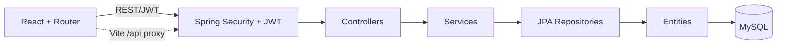

# AgriConnect Project Documentation

**Audit basis:** repository source inspected on 1 October 2026. Status distinguishes source implementation from runtime testing. No application/build/test was run.

## 1. Project Title

AgriConnect: A Digital Agricultural Marketplace with Field Coordinator Support.

## 2–5. Overview, Problem, Objectives, Proposed Solution

AgriConnect is a React SPA and Spring Boot REST service for farmer crop listings, buyer discovery, and coordinator-assisted farmer records/listings. The intended problem is giving farmers a digital channel to expose crop availability while supporting those who may need field assistance. The software supports registered farmer accounts and a separate collected-farmer record pathway. Its objectives are role-based access, farmer-owned crop CRUD, marketplace discovery, and coordinator-managed assisted listings. The application architecture uses React/Vite, stateless REST/JWT, Spring services/JPA, and MySQL. These are software objectives, not evidence of real-world impact.

## 6–7. Target Users and Roles

| Role | Current evidence/status |
|---|---|
| FARMER | Registration/login and core crop CRUD/owner API checks passed; dashboard UI not browser-tested. |
| BUYER | Login and marketplace list/detail API checks passed; purchase flow absent and interactive UI not browser-tested. |
| MIDDLEMAN (Field Coordinator) | Signup/login and collected farmer/crop API checks passed; dashboard UI not browser-tested. |
| ADMIN | Public registration rejects this role. A read-only dashboard, account overview, and crop listing API/UI now exist under `ROLE_ADMIN`. Real account provisioning/login was not verified. |

Authorities normalize to `ROLE_*`; Spring checks `ROLE_FARMER`, `ROLE_MIDDLEMAN`, `ROLE_ADMIN`. Buyer role is `ROLE_BUYER`.

## 8–9. Project Flow and Architecture

```text
Register/login -> BCrypt/auth manager -> JWT -> localStorage -> Axios Bearer
-> JWT filter -> authority checks -> controller -> service -> repository -> MySQL

Farmer -> own Crop (owner is authenticated User)
Coordinator -> CollectedFarmer (collectedBy coordinator) -> Crop.collectedFarmer
Marketplace -> Crop DTO -> registered farmer name OR collected farmer name
```



## 10. Technology Stack

| Layer | Manifest/config evidence |
|---|---|
| Frontend | React 18.3.1, Vite 5.2.11, JavaScript, Router 6.23.1, Axios 1.6.8, Lucide React 0.378.0, Tailwind 3.4.3 |
| Backend | Java 17; Spring Boot 3.2.5; Web, Security, Data JPA, Validation; Maven |
| Database | MySQL Connector/J; Hibernate/JPA; configured DB `agriconnect_db` |
| Security | JJWT 0.11.5, BCrypt, stateless Spring Security |
| Verification | Backend Maven verify passed after focused tests; frontend production build passed; interactive UI testing partial |

Local runtime configuration uses `AGRICONNECT_DB_PASSWORD` for MySQL and `AGRICONNECT_JWT_SECRET` for JWT signing. The signing secret must be Base64 encoded and decode to at least 32 bytes for HS256. Keep these values in a local environment or ignored local override file. They were not available in the workspace during the final interactive verification, so successful live login/token issuance remains unverified.

## 11. Frontend Architecture and Route Map

`main.jsx` mounts `App`; `App.jsx` defines routes and `AuthProvider`; `AuthContext` restores localStorage and calls profile; `services/api.js` holds Axios service calls; layouts/pages implement role views. `/api` is proxied to `localhost:8080`. The Admin layout/dashboard use read-only APIs. JWT in localStorage is exposed to successful same-origin script injection. Production build passed; interactive browser flows were not exercised because browser automation was unavailable.

| Route | Frontend access |
|---|---|
| `/login`, `/register` | Public |
| `/farmer`, `/farmer/dashboard`, `/farmer/crops`, `/farmer/crops/add`, `/farmer/crops/edit/:id`, `/farmer/crops/:id` | `ROLE_FARMER` |
| `/marketplace`, `/marketplace/crops/:id` | `ROLE_BUYER`, `ROLE_FARMER` |
| `/middleman`, `/middleman/dashboard`, `/middleman/farmers`, `/middleman/farmers/add`, `/middleman/farmers/edit/:id` | `ROLE_MIDDLEMAN`, `ROLE_ADMIN` |
| `/admin`, `/admin/dashboard` | `ROLE_ADMIN` |
| `/`, unmatched | Redirect to `/login` |

Buyer marketplace is protected, not public. Login redirects include all four roles. Public registration still accepts only FARMER, BUYER, and MIDDLEMAN.

## 12. Backend Architecture

- Controllers: `AuthController`, `CropController`, `MarketplaceController`, `MiddlemanController`, and read-only `AdminController`.
- Services: Auth, Crop, CollectedFarmer, and Admin services.
- Repositories: User, Role, Crop, CollectedFarmer.
- Entities: User, Role, Crop, CollectedFarmer; DTO request/response mapping.
- Security/config: `SecurityConfig`, JWT filter, UserDetails service, `JwtUtil`, `WebConfig`.
- Error handling: `GlobalExceptionHandler`, `CustomException`.

## 13. Database Design and Entity Relationships

Local MySQL URL names `agriconnect_db`; `ddl-auto=update` allows Hibernate schema mutation. Four JPA entities define current persistence. Runtime inspection of the existing DB and a fresh isolated JPA-created DB found `roles`, `users`, `crops`, and `collected_farmers`. Root `schema.sql` and README describe a different 15-table design with orders/payments/cart/reviews/etc.; it is not the current entity/controller implementation. No migrations found.

```text
Role 1 --- * User
User 1 --- * Crop (registered farmer; nullable FK)
User 1 --- * CollectedFarmer (required collectedBy coordinator)
User 0..1 --- * CollectedFarmer (optional linkedFarmer account)
CollectedFarmer 1 --- * Crop (nullable FK)
```

Both crop owner FKs are nullable and no exactly-one-owner constraint exists. Current service paths set one. `linkedFarmer` is separate and does not drive listing attribution.

## 14–15. Authentication and Authorization

Registration validates fields, BCrypt-encodes password, creates the requested allowed role if absent, saves user, and returns JWT. Login delegates to `AuthenticationManager`. JWT subject is email, configured expiry one day. Filter validates token and reloads user details. Profile DTO excludes password/token. Farmer, Buyer, and Coordinator signup/login, invalid login, JWT profile, and ADMIN signup rejection were runtime checked against a disposable DB.

Farmer APIs require `ROLE_FARMER`; coordinator APIs require `ROLE_MIDDLEMAN` or `ROLE_ADMIN`; marketplace APIs permit buyer/farmer/admin. Farmer services scope crop lookups by authenticated user ID. Coordinator services scope records by `collectedBy`, except admin. Public registration validation now allows only FARMER, BUYER, and MIDDLEMAN; an HTTP registration attempt for ADMIN returned 400. No supported admin provisioning workflow was verified.

Admin APIs (`/api/admin/dashboard`, `/api/admin/users`, `/api/admin/crops`) require `ROLE_ADMIN` and only read data. The account DTO omits password and token fields. Dashboard counts users by role, total crops, and available crops. Crop overview includes unavailable listings and preserves registered/collected farmer attribution. Automated MockMvc tests cover Admin access and denial for Farmer, Buyer, and Coordinator. An opt-in `local`/`dev` profile startup mechanism can promote an existing registered account when explicitly enabled by environment settings; no credentials are embedded. Account availability and interactive Admin login remain unverified.

The Admin screen at `/admin/dashboard` displays those statistics, a read-only user table, and all crop listings with farmer attribution, quantity, price and availability. No account or crop mutation controls were added to this screen. Create an account through ordinary registration, then use the documented local/dev opt-in promotion only when a local evaluation Admin account is needed.

## 16. Farmer Module

| Feature | Status | Evidence/notes |
|---|---|---|
| Registration/login API | IMPLEMENTED AND VERIFIED | Farmer signup/login HTTP checks; auth behavior preserved |
| Farmer dashboard UI | IMPLEMENTED BUT NOT VERIFIED | Dashboard route/page source exists; browser interaction not run |
| Crop create/list/update/delete API | IMPLEMENTED AND VERIFIED | Passed on isolated DB; owner and farmer scope checks |
| Ownership | IMPLEMENTED AND VERIFIED (partial cases) | Own create/list/update/delete passed; foreign read/update denied; foreign delete not separately tested |
| Availability/category/price/quantity/location/description/image URL | IMPLEMENTED BUT NOT VERIFIED | DTO/entity/forms |
| Farmer-side image upload | PLANNED / NOT IMPLEMENTED | Form takes URL; upload endpoint is coordinator API |

Delete is hard delete, not soft archive as older docs claim.

## 17–20. Buyer, Coordinator, Marketplace, Search

| Feature | Status | Notes |
|---|---|---|
| Available crop list/details | IMPLEMENTED AND VERIFIED (sample listing) | Buyer list/detail HTTP calls passed; exclusion of unavailable fixtures not tested |
| Name display for collected farmer crop | IMPLEMENTED AND VERIFIED | Suresh Kumar shown; collected marker true; farmerId null |
| Buyer search | IMPLEMENTED BUT NOT VERIFIED | Client-side crop-name substring search |
| Category/location filters | IMPLEMENTED BUT NOT VERIFIED | Client-side exact category and location substring filters; UI not browser-tested |
| Price filter/backend paging | PLANNED / NOT IMPLEMENTED | Not found in current code |
| Buyer public farmer info | PARTIALLY IMPLEMENTED | Marketplace DTO gives display name; no public account profile. No password/JWT fields serialized. |
| Coordinator farmer CRUD/stats | IMPLEMENTED AND VERIFIED (own records) | Create/list/detail/edit and deletion of an empty own record passed; cross-coordinator isolation pending |
| Coordinator account search/link | IMPLEMENTED BUT NOT VERIFIED | Source exists; HTTP flow not exercised |
| Coordinator crop create/list for collected farmer | IMPLEMENTED AND VERIFIED | HTTP create/list passed on isolated DB |
| Coordinator crop update/delete | IMPLEMENTED BUT NOT VERIFIED | Endpoint source exists; HTTP actions not exercised |
| Crop image handling | PARTIALLY IMPLEMENTED | Coordinator local upload; farmer uses URL; upload endpoint not exercised |
| Orders/cart/payments/reviews/notifications | PLANNED / NOT IMPLEMENTED | README/schema only; no live JPA/API/UI |

Collected farmer fields: farmerName, phoneNumber, village, district, state, farmingType, primaryCrop, landArea/unit, approximateProduction/unit, preferredMarket, notes, collectedBy, optional linkedFarmer, timestamps. Coordinator account search response includes farmer email/phone and is coordinator protected.

## 21–22. Current Features and Completed Work

Source contains auth/JWT, farmer crop management, buyer listing/detail, coordinator collected farmer CRUD, coordinator-assisted crops, stats and account linking. Git commits indicate incremental frontend/auth/coordinator work. Source presence does not establish runtime success. See `PROJECT_STATUS.md` for phased status and commit summary.

### API inventory (actual controller mappings)

All API routes below require authentication except register/login. `ROLE_*` requirements come from `SecurityConfig`; ownership rules are service-level. Body fields are summarized from DTOs, not runtime-tested.

| Method and path | Purpose / request | Access and response / checks |
|---|---|---|
| `POST /api/auth/register` | `RegisterRequest`: email, password, firstName, lastName, phoneNumber, role | Public; returns `AuthResponse` with JWT/profile fields. FARMER, BUYER, MIDDLEMAN accepted; ADMIN rejected with 400. |
| `POST /api/auth/login` | `LoginRequest`: email, password | Public; returns `AuthResponse`. |
| `GET /api/auth/profile` | No body | Any authenticated role; profile DTO, no password/token. |
| `POST /api/farmer/crops` | `CropRequest`: cropName/category/description/quantity/unit/pricePerUnit/location/imageUrl/available | FARMER; 201 `CropResponse`, owner set to principal user. |
| `GET /api/farmer/crops` | No body | FARMER; caller's crops only. |
| `GET /api/farmer/crops/{id}` | Path id | FARMER; owner-scoped; 404 for absent/foreign record. |
| `PUT /api/farmer/crops/{id}` | Same validated CropRequest | FARMER; owner-scoped update. |
| `DELETE /api/farmer/crops/{id}` | Path id | FARMER; owner-scoped hard delete, 204. |
| `GET /api/marketplace/crops` | No body | BUYER/FARMER/ADMIN; available crops only; CropResponse list. |
| `GET /api/marketplace/crops/{id}` | Path id | BUYER/FARMER/ADMIN; available crop detail; CropResponse. |
| `POST /api/middleman/farmers` | `CollectedFarmerRequest` with name, phone, village, location/farming/production/market/notes fields | MIDDLEMAN/ADMIN; 201; collectedBy set to principal. |
| `GET /api/middleman/farmers` | No body | MIDDLEMAN own records; ADMIN all; response includes coordinator and optional linked-account data. |
| `GET /api/middleman/farmers/stats` | No body | MIDDLEMAN own stats; ADMIN aggregate stats. |
| `GET /api/middleman/farmers/search?query=...` | Optional query | MIDDLEMAN/ADMIN; searches registered FARMER accounts; response includes email/phone. |
| `GET /api/middleman/farmers/{id}` | Path id | MIDDLEMAN owner or ADMIN; CollectedFarmerResponse. |
| `PUT /api/middleman/farmers/{id}` | CollectedFarmerRequest | MIDDLEMAN owner or ADMIN; update response. |
| `DELETE /api/middleman/farmers/{id}` | Path id | MIDDLEMAN owner or ADMIN; 204. Cascade/orphan behavior is not configured in entity code. |
| `PUT /api/middleman/farmers/{collectedFarmerId}/link/{farmerUserId}` | Path IDs | MIDDLEMAN record owner or ADMIN; target must have FARMER role. |
| `PUT /api/middleman/farmers/{collectedFarmerId}/unlink` | Path id | MIDDLEMAN record owner or ADMIN; removes optional account link. |
| `POST /api/middleman/farmers/{collectedFarmerId}/crops` | CropRequest | MIDDLEMAN owner or ADMIN; 201; crop linked to CollectedFarmer. |
| `GET /api/middleman/farmers/{collectedFarmerId}/crops` | Path id | MIDDLEMAN owner or ADMIN; crops for that collected record. |
| `PUT /api/middleman/crops/{cropId}` | CropRequest | MIDDLEMAN owning the crop's collected record or ADMIN; update. |
| `DELETE /api/middleman/crops/{cropId}` | Path id | MIDDLEMAN owning collected record or ADMIN; hard delete, 204. |
| `POST /api/middleman/crops/upload-image` | Multipart `file` | MIDDLEMAN/ADMIN by URL matcher; checks reported MIME and 5 MB; writes local file and returns `imageUrl`. |

No category, price/location filter, order, cart, payment, review, or notification API exists in the inspected controllers.

## 23. Remaining Work

- **P0 Critical:** rotate tracked DB/JWT secrets and externalize deployment values; define safe admin provisioning; harden upload handling.
- **P1 Important:** expand automated role/ownership/attribution/privacy coverage and finish pending manual cases; verify browser flows; enforce exactly-one crop owner; clarify linked-account semantics; reconcile README/schema/API docs; return safe generic 500 errors.
- **P2 Enhancement:** backend filters/pagination, public farmer profiles, farmer-side image upload, accessibility/input/error-state review.
- **P3 Future:** admin dashboard, orders/payments, cart, reviews, notifications, deployment/monitoring.
- Academic: verified literature review, privacy/ethics protocol, repeatable evaluation, real outcomes only after measurement, demo preparation.

## 24–26. Testing Status, Limitations, Future Scope

Backend Maven `verify` passed with six JUnit tests (0 failures/errors/skips); frontend `npm.cmd run build` passed. Manual HTTP regression checks on an isolated generated MySQL database passed for role signup/login, ADMIN signup rejection, invalid login, JWT profile, unauthenticated/role-denied requests, farmer crop create/list/edit/delete and cross-owner read/update denial, coordinator collected-farmer CRUD, coordinator crop create/list, buyer marketplace list/detail, and correct Suresh Kumar attribution. After the DTO fix, runtime logs contained neither the sentinel password nor auth request DTO print strings. Vite served `/login` and `/marketplace` SPA shells and its `/api` proxy reached the backend. Interactive dashboard rendering, search/category/location UI behavior, invalid inputs, unavailable-crop exclusion, image upload, and cross-coordinator isolation remain unverified. See `TESTING_PLAN.md` for case status. Limits include no frontend automated tests, no order flow, local image storage, no migrations and stale root README/schema design.

### Runtime database verification

The existing MySQL schema and a separate fresh JPA-generated schema both contained `collected_farmers`, `crops`, `roles`, and `users`. Verified foreign keys: `users.role_id → roles.id`; `collected_farmers.collected_by → users.id` (NOT NULL); `collected_farmers.linked_farmer_id → users.id` (nullable); `crops.farmer_id → users.id` (nullable); `crops.collected_farmer_id → collected_farmers.id` (nullable). Crop owner references are not constrained to exactly one owner.

Root `schema.sql` declares 15 tables: roles, users, farmers, buyers, categories, products, crop_images, orders, order_items, payments, wishlist, cart, reviews, notifications, collected_farmers. It does not define the current `crops` table/current crop-owner FKs and includes commerce entities not present in JPA/API code. It remains stale/planned and was not rewritten.

### Local startup configuration and commands

MySQL service `MySQL80` was running during verification. If stopped, start it with elevated PowerShell: `Start-Service MySQL80`. Ensure `agriconnect_db` exists; do not run root `schema.sql` as the current application schema. The backend expects local MySQL, username `root`, `AGRICONNECT_DB_PASSWORD`, and `AGRICONNECT_JWT_SECRET`. The ignored `agriconnect-backend/application-local.properties` preserves this machine's existing local settings and is imported optionally; deployments should supply the two environment variables. JDK 21 successfully compiled the Java 17-targeted backend.

```powershell
Set-Location F:\React\AgriConnect\agriconnect-backend
mvn "-Dmaven.repo.local=$env:TEMP\agriconnect-m2" spring-boot:run
```

```powershell
Set-Location F:\React\AgriConnect\agriconnect-frontend
npm.cmd run dev
```

Vite serves port 5173 and proxies `/api` to port 8080. On this host Maven's default repository was unwritable, so verification used `mvn -B "-Dmaven.repo.local=$env:TEMP\agriconnect-m2" verify`. PowerShell's `npm.ps1` was blocked by execution policy; `npm.cmd` worked.

## 27. Research Scope

The code supports a system-design/implementation study of digital crop discovery and coordinator-assisted listing. It does not evidence adoption, inclusion, income, efficiency, price or market outcomes. Research gap must be established from literature, not inferred from this code alone.

## 28. UML Diagrams to Prepare (not generated)

- Use case: farmer account/crop management, buyer browse/details, coordinator farmer/crop assistance; admin only after scope defined.
- Class/ER: four entities and actual owner/link relationships.
- Component: React services/routes, controllers, services, repositories, entities, MySQL, upload handling.
- Deployment: browser, dev Vite proxy, Spring server, MySQL, local upload directory; production topology unknown.
- Sequence: login/JWT request, farmer listing, coordinator listing and marketplace attribution.

## 29. Conclusion

Source implements the main farmer listing, buyer discovery, and coordinator-assisted listing paths. Manual API checks verified the main CRUD/attribution flow. Public ADMIN registration and auth DTO password stringification were fixed. Interactive UI and negative cases remain partly unverified; tracked credentials were moved out of working config but remain in Git history and require coordinated rotation. Planned commerce capabilities must not be described as implemented.

## Files inspected

Repository inventory and source review covered `.gitignore`, `README.md`, `implementation_plan.md`, `schema.sql`; backend `pom.xml`, `src/main/resources/application.properties`, all Java files under `src/main/java/com/agriconnect/{controller,service,entity,dto,repository,config,security,util,exception}`, and application bootstrap; frontend `package.json`, `package-lock.json`, Vite/Tailwind/PostCSS configs, `index.html`, and all source files under `src/{App.jsx,main.jsx,index.css,components,context,layouts,pages,services}`. Git status, branches, and recent history were inspected. Binary/generated artifacts, database contents and ignored-file contents were not inspected.
