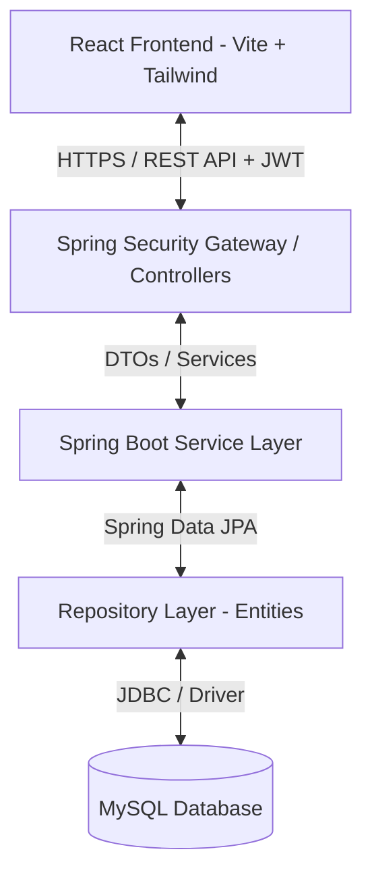
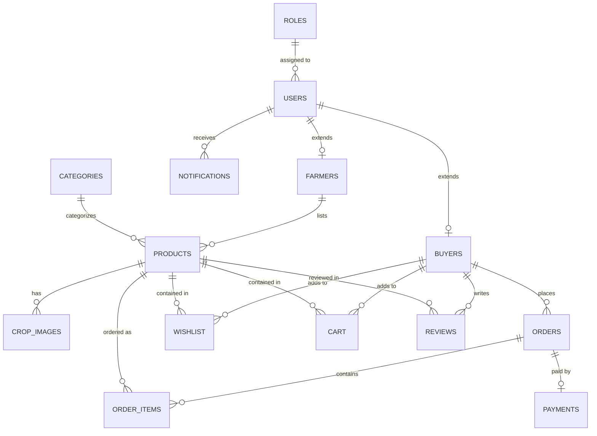

# Implementation Plan: AgriConnect – Farmer Marketplace (Phase 1)

This implementation plan covers the system architecture, directory structures, database schema (MySQL), ER diagram, REST API list, and setup instructions for **AgriConnect – Farmer Marketplace**. No business logic or UI pages will be generated in this phase, only the architecture designs, configurations, and project skeletons.

---

## 1. System Architecture

AgriConnect is designed using a modern decoupled client-server architecture.



### Components:
1.  **Frontend (Client)**: 
    *   Single Page Application (SPA) built using **React.js** (via Vite).
    *   Styled using **Tailwind CSS** for responsive, mobile-first design.
    *   Routing handled by **React Router DOM**.
    *   API communication handled by **Axios** with global interceptors for JWT injection and error handling.
2.  **Backend (Server)**:
    *   **Spring Boot** application using **Java 17+** and **Maven** for dependency management.
    *   **Controller Layer**: Exposes REST endpoints, validates inputs, handles mapping.
    *   **Security Layer**: Configured with **Spring Security** and stateless **JWT Authentication** filters to secure endpoints.
    *   **Service Layer**: Handles core business logic, transactional boundaries, validation, and mappings.
    *   **Repository Layer**: Utilizes **Spring Data JPA** (Hibernate) for Object-Relational Mapping (ORM) to MySQL.
3.  **Database**:
    *   **MySQL** relational database hosting user data, product catalogs, transactions, and notification logs.

---

## 2. Proposed Project Structure

We will initialize two main directories inside the workspace `f:\React\AgriConnect`:
1.  `agriconnect-frontend/` (Vite + React.js + Tailwind CSS)
2.  `agriconnect-backend/` (Spring Boot + Maven)

Here is the planned directory hierarchy:

```
f:\React\AgriConnect\
├── agriconnect-frontend/
│   ├── public/
│   ├── src/
│   │   ├── assets/             # Static files (images, icons)
│   │   ├── components/         # Reusable presentation components (Buttons, Inputs, Modals, Navbar, Footer)
│   │   ├── context/            # React Contexts (AuthContext, CartContext, NotificationContext)
│   │   ├── hooks/              # Custom React hooks (useAuth, useFetch)
│   │   ├── layouts/            # Page layouts (AdminLayout, FarmerLayout, BuyerLayout, AuthLayout)
│   │   ├── pages/              # Page view components (skeleton structures)
│   │   ├── router/             # Routing configuration and Guarded Routes
│   │   ├── services/           # Axios API service instances and endpoints
│   │   ├── utils/              # Helper utilities and formatters
│   │   ├── App.jsx
│   │   ├── index.css           # Tailwind CSS directives
│   │   └── main.jsx
│   ├── .gitignore
│   ├── eslint.config.js
│   ├── index.html
│   ├── package.json
│   ├── tailwind.config.js
│   └── vite.config.js
│
├── agriconnect-backend/
│   ├── src/
│   │   ├── main/
│   │   │   ├── java/com/agriconnect/
│   │   │   │   ├── config/      # Spring Security, JWT, WebMvc configurations
│   │   │   │   ├── controller/  # REST Controllers
│   │   │   │   ├── dto/         # Request and Response DTOs
│   │   │   │   ├── entity/      # JPA Entity models
│   │   │   │   ├── exception/   # Global exception handler and custom exceptions
│   │   │   │   ├── repository/  # Spring Data JPA Repository interfaces
│   │   │   │   ├── security/    # Custom UserDetailsService, JWT token provider, filter chain
│   │   │   │   ├── service/     # Service interfaces and implementations
│   │   │   │   └── AgriConnectApplication.java
│   │   │   └── resources/
│   │   │       ├── application.properties  # Database credentials, JPA settings, JWT secrets
│   │   │       └── db/migration/           # (Optional) SQL schema setup script location
│   │   └── test/
│   ├── .gitignore
│   ├── pom.xml                  # Maven Project Object Model file
│   └── README.md
│
└── README.md                    # Main Project Overview and Setup Guide
```

---

## 3. Database Design & SQL Script

We will design a schema supporting roles, farmers, buyers, categories, products, images, orders, order details, payments, wishlists, carts, reviews, and notifications.

### Database Tables:
1.  **roles**: Stores standard user roles (`ROLE_ADMIN`, `ROLE_FARMER`, `ROLE_BUYER`).
2.  **users**: Stores core credentials, email, phone, status, and references a role.
3.  **farmers**: Holds farmer-specific profile info (farm name, farm size, state, city, pin code, UPI ID, verification status).
4.  **buyers**: Holds buyer-specific profile info (business/company name, GST number, shipping address).
5.  **categories**: Groups products (e.g., Grains, Vegetables, Fruits, Spices, Dairy).
6.  **products**: Stores product information, pricing, units (kg, quintal, ton), stock, harvesting date, status (Active, Inactive).
7.  **crop_images**: Support for multiple product images, pointing back to products.
8.  **orders**: Tracks orders placed by buyers, status, addresses, and transaction amounts.
9.  **order_items**: Line items detailing quantity and historical price per unit.
10. **payments**: Records transactions associated with orders (status, payment mode, gateway ID).
11. **wishlist**: Keeps track of bookmarked products for buyers.
12. **cart**: Stores items added to cart before purchase.
13. **reviews**: Allows buyers to rate products (1-5 rating) and write feedback.
14. **notifications**: Log user notifications for order status changes, price updates, etc.

---

### Entity Relationship (ER) Diagram
The following entity relationships will be implemented:



---

### Database SQL Script (`schema.sql`)

```sql
CREATE DATABASE IF NOT EXISTS agriconnect_db;
USE agriconnect_db;

-- 1. Roles Table
CREATE TABLE roles (
    id INT AUTO_INCREMENT PRIMARY KEY,
    name VARCHAR(30) UNIQUE NOT NULL,
    description VARCHAR(255)
) ENGINE=InnoDB DEFAULT CHARSET=utf8mb4 COLLATE=utf8mb4_unicode_ci;

-- 2. Users Table
CREATE TABLE users (
    id BIGINT AUTO_INCREMENT PRIMARY KEY,
    email VARCHAR(100) UNIQUE NOT NULL,
    password VARCHAR(255) NOT NULL,
    first_name VARCHAR(50) NOT NULL,
    last_name VARCHAR(50) NOT NULL,
    phone_number VARCHAR(15) UNIQUE NOT NULL,
    role_id INT NOT NULL,
    is_active BOOLEAN DEFAULT TRUE,
    created_at TIMESTAMP DEFAULT CURRENT_TIMESTAMP,
    updated_at TIMESTAMP DEFAULT CURRENT_TIMESTAMP ON UPDATE CURRENT_TIMESTAMP,
    FOREIGN KEY (role_id) REFERENCES roles(id) ON DELETE RESTRICT
) ENGINE=InnoDB DEFAULT CHARSET=utf8mb4 COLLATE=utf8mb4_unicode_ci;

-- 3. Farmers Table
CREATE TABLE farmers (
    id BIGINT AUTO_INCREMENT PRIMARY KEY,
    user_id BIGINT UNIQUE NOT NULL,
    farm_name VARCHAR(100),
    farm_size_acres DECIMAL(6,2),
    state VARCHAR(50) NOT NULL,
    city VARCHAR(50) NOT NULL,
    pincode VARCHAR(6) NOT NULL,
    address_line VARCHAR(255),
    upi_id VARCHAR(50) NOT NULL,
    certificate_number VARCHAR(50),
    is_verified BOOLEAN DEFAULT FALSE,
    created_at TIMESTAMP DEFAULT CURRENT_TIMESTAMP,
    updated_at TIMESTAMP DEFAULT CURRENT_TIMESTAMP ON UPDATE CURRENT_TIMESTAMP,
    FOREIGN KEY (user_id) REFERENCES users(id) ON DELETE CASCADE
) ENGINE=InnoDB DEFAULT CHARSET=utf8mb4 COLLATE=utf8mb4_unicode_ci;

-- 4. Buyers Table
CREATE TABLE buyers (
    id BIGINT AUTO_INCREMENT PRIMARY KEY,
    user_id BIGINT UNIQUE NOT NULL,
    business_name VARCHAR(100),
    gst_number VARCHAR(15) UNIQUE,
    shipping_address TEXT NOT NULL,
    created_at TIMESTAMP DEFAULT CURRENT_TIMESTAMP,
    updated_at TIMESTAMP DEFAULT CURRENT_TIMESTAMP ON UPDATE CURRENT_TIMESTAMP,
    FOREIGN KEY (user_id) REFERENCES users(id) ON DELETE CASCADE
) ENGINE=InnoDB DEFAULT CHARSET=utf8mb4 COLLATE=utf8mb4_unicode_ci;

-- 5. Categories Table
CREATE TABLE categories (
    id INT AUTO_INCREMENT PRIMARY KEY,
    name VARCHAR(50) UNIQUE NOT NULL,
    description TEXT,
    image_url VARCHAR(255)
) ENGINE=InnoDB DEFAULT CHARSET=utf8mb4 COLLATE=utf8mb4_unicode_ci;

-- 6. Products Table
CREATE TABLE products (
    id BIGINT AUTO_INCREMENT PRIMARY KEY,
    farmer_id BIGINT NOT NULL,
    category_id INT NOT NULL,
    name VARCHAR(100) NOT NULL,
    description TEXT,
    price_per_unit DECIMAL(10,2) NOT NULL,
    unit_type VARCHAR(20) NOT NULL, -- e.g., kg, quintal, ton, bag
    stock_quantity DECIMAL(10,2) NOT NULL,
    harvesting_date DATE,
    status VARCHAR(20) DEFAULT 'AVAILABLE', -- AVAILABLE, OUT_OF_STOCK, ARCHIVED
    created_at TIMESTAMP DEFAULT CURRENT_TIMESTAMP,
    updated_at TIMESTAMP DEFAULT CURRENT_TIMESTAMP ON UPDATE CURRENT_TIMESTAMP,
    FOREIGN KEY (farmer_id) REFERENCES farmers(id) ON DELETE CASCADE,
    FOREIGN KEY (category_id) REFERENCES categories(id) ON DELETE RESTRICT
) ENGINE=InnoDB DEFAULT CHARSET=utf8mb4 COLLATE=utf8mb4_unicode_ci;

-- 7. Crop Images Table
CREATE TABLE crop_images (
    id BIGINT AUTO_INCREMENT PRIMARY KEY,
    product_id BIGINT NOT NULL,
    image_url VARCHAR(255) NOT NULL,
    is_primary BOOLEAN DEFAULT FALSE,
    created_at TIMESTAMP DEFAULT CURRENT_TIMESTAMP,
    FOREIGN KEY (product_id) REFERENCES products(id) ON DELETE CASCADE
) ENGINE=InnoDB DEFAULT CHARSET=utf8mb4 COLLATE=utf8mb4_unicode_ci;

-- 8. Orders Table
CREATE TABLE orders (
    id BIGINT AUTO_INCREMENT PRIMARY KEY,
    buyer_id BIGINT NOT NULL,
    total_amount DECIMAL(12,2) NOT NULL,
    status VARCHAR(30) DEFAULT 'PENDING', -- PENDING, CONFIRMED, SHIPPED, DELIVERED, CANCELLED
    shipping_address TEXT NOT NULL,
    created_at TIMESTAMP DEFAULT CURRENT_TIMESTAMP,
    updated_at TIMESTAMP DEFAULT CURRENT_TIMESTAMP ON UPDATE CURRENT_TIMESTAMP,
    FOREIGN KEY (buyer_id) REFERENCES buyers(id) ON DELETE RESTRICT
) ENGINE=InnoDB DEFAULT CHARSET=utf8mb4 COLLATE=utf8mb4_unicode_ci;

-- 9. Order Items Table
CREATE TABLE order_items (
    id BIGINT AUTO_INCREMENT PRIMARY KEY,
    order_id BIGINT NOT NULL,
    product_id BIGINT NOT NULL,
    quantity DECIMAL(10,2) NOT NULL,
    price_per_unit DECIMAL(10,2) NOT NULL,
    FOREIGN KEY (order_id) REFERENCES orders(id) ON DELETE CASCADE,
    FOREIGN KEY (product_id) REFERENCES products(id) ON DELETE RESTRICT
) ENGINE=InnoDB DEFAULT CHARSET=utf8mb4 COLLATE=utf8mb4_unicode_ci;

-- 10. Payments Table
CREATE TABLE payments (
    id BIGINT AUTO_INCREMENT PRIMARY KEY,
    order_id BIGINT UNIQUE NOT NULL,
    transaction_id VARCHAR(100) UNIQUE NOT NULL,
    payment_mode VARCHAR(30) NOT NULL, -- UPI, CARD, NET_BANKING, COD
    status VARCHAR(30) DEFAULT 'PENDING', -- PENDING, SUCCESS, FAILED
    amount DECIMAL(12,2) NOT NULL,
    paid_at TIMESTAMP NULL,
    created_at TIMESTAMP DEFAULT CURRENT_TIMESTAMP,
    FOREIGN KEY (order_id) REFERENCES orders(id) ON DELETE RESTRICT
) ENGINE=InnoDB DEFAULT CHARSET=utf8mb4 COLLATE=utf8mb4_unicode_ci;

-- 11. Wishlist Table
CREATE TABLE wishlist (
    id BIGINT AUTO_INCREMENT PRIMARY KEY,
    buyer_id BIGINT NOT NULL,
    product_id BIGINT NOT NULL,
    created_at TIMESTAMP DEFAULT CURRENT_TIMESTAMP,
    UNIQUE KEY unique_wishlist (buyer_id, product_id),
    FOREIGN KEY (buyer_id) REFERENCES buyers(id) ON DELETE CASCADE,
    FOREIGN KEY (product_id) REFERENCES products(id) ON DELETE CASCADE
) ENGINE=InnoDB DEFAULT CHARSET=utf8mb4 COLLATE=utf8mb4_unicode_ci;

-- 12. Cart Table
CREATE TABLE cart (
    id BIGINT AUTO_INCREMENT PRIMARY KEY,
    buyer_id BIGINT NOT NULL,
    product_id BIGINT NOT NULL,
    quantity DECIMAL(10,2) NOT NULL,
    created_at TIMESTAMP DEFAULT CURRENT_TIMESTAMP,
    updated_at TIMESTAMP DEFAULT CURRENT_TIMESTAMP ON UPDATE CURRENT_TIMESTAMP,
    UNIQUE KEY unique_cart (buyer_id, product_id),
    FOREIGN KEY (buyer_id) REFERENCES buyers(id) ON DELETE CASCADE,
    FOREIGN KEY (product_id) REFERENCES products(id) ON DELETE CASCADE
) ENGINE=InnoDB DEFAULT CHARSET=utf8mb4 COLLATE=utf8mb4_unicode_ci;

-- 13. Reviews Table
CREATE TABLE reviews (
    id BIGINT AUTO_INCREMENT PRIMARY KEY,
    product_id BIGINT NOT NULL,
    buyer_id BIGINT NOT NULL,
    rating INT NOT NULL CHECK (rating BETWEEN 1 AND 5),
    comment TEXT,
    created_at TIMESTAMP DEFAULT CURRENT_TIMESTAMP,
    UNIQUE KEY unique_review (product_id, buyer_id),
    FOREIGN KEY (product_id) REFERENCES products(id) ON DELETE CASCADE,
    FOREIGN KEY (buyer_id) REFERENCES buyers(id) ON DELETE RESTRICT
) ENGINE=InnoDB DEFAULT CHARSET=utf8mb4 COLLATE=utf8mb4_unicode_ci;

-- 14. Notifications Table
CREATE TABLE notifications (
    id BIGINT AUTO_INCREMENT PRIMARY KEY,
    user_id BIGINT NOT NULL,
    title VARCHAR(100) NOT NULL,
    message TEXT NOT NULL,
    is_read BOOLEAN DEFAULT FALSE,
    created_at TIMESTAMP DEFAULT CURRENT_TIMESTAMP,
    FOREIGN KEY (user_id) REFERENCES users(id) ON DELETE CASCADE
) ENGINE=InnoDB DEFAULT CHARSET=utf8mb4 COLLATE=utf8mb4_unicode_ci;

-- 15. Default Roles Setup
INSERT INTO roles (id, name, description) VALUES
(1, 'ROLE_ADMIN', 'Platform Administrator'),
(2, 'ROLE_FARMER', 'Producer and Seller of Crops'),
(3, 'ROLE_BUYER', 'Consumer or Wholesaler Purchasing Crops');
```

---

## 4. REST API Specification List

All backend routes are prefixed with `/api`. Secure routes require a Bearer JWT Token in the `Authorization` header.

### 4.1 Authentication & Profile API
*   `POST /api/auth/register` (Public) - Register new User (Farmer/Buyer roles)
*   `POST /api/auth/login` (Public) - Credentials login, returns token, roles, and profile outline
*   `GET /api/users/profile` (Authenticated) - Get current user core details
*   `PUT /api/farmers/profile` (Farmer role) - Complete / Update Farm details
*   `PUT /api/buyers/profile` (Buyer role) - Complete / Update Billing/Shipping details

### 4.2 Product & Catalog API
*   `GET /api/categories` (Public) - List all crop categories
*   `POST /api/categories` (Admin role) - Create new category
*   `GET /api/products` (Public) - Fetch catalog (paginated, filterable by query, category, min/max price, location)
*   `GET /api/products/{id}` (Public) - Detailed product details (includes pictures and vendor ratings)
*   `POST /api/products` (Farmer role) - Publish a crop listing
*   `PUT /api/products/{id}` (Farmer role) - Edit crop listing (price, stock)
*   `DELETE /api/products/{id}` (Farmer / Admin role) - Delete or soft-archive crop listing
*   `POST /api/products/{id}/images` (Farmer role) - Upload multi-part image files for the crop listing

### 4.3 Cart & Wishlist API (Buyer Role Only)
*   `GET /api/cart` - Retrieve current shopping cart details
*   `POST /api/cart` - Add a crop item to cart
*   `PUT /api/cart/{cartItemId}` - Modify quantity of a cart item
*   `DELETE /api/cart/{cartItemId}` - Remove item from cart
*   `DELETE /api/cart/clear` - Clear all items
*   `GET /api/wishlist` - View saved crops
*   `POST /api/wishlist` - Toggle crop item addition/removal in wishlist

### 4.4 Orders & Payments API
*   `POST /api/orders` (Buyer role) - Checkout cart items, create order record
*   `GET /api/orders/{id}` (Authenticated) - View order invoices and status
*   `GET /api/orders/buyer` (Buyer role) - Get personal buying history
*   `GET /api/orders/farmer` (Farmer role) - Get incoming sales order dashboard
*   `PUT /api/orders/{id}/status` (Farmer / Admin role) - Move status (e.g. CONFIRMED, SHIPPED, DELIVERED, CANCELLED)
*   `POST /api/payments/process` (Buyer role) - Submits mock/sandbox transaction details (transaction id, status) for an order

### 4.5 Product Reviews & Feedback API
*   `POST /api/reviews` (Buyer role) - Post rating (1-5) and feedback for a purchased crop
*   `GET /api/products/{productId}/reviews` (Public) - Read ratings and comments for a product

### 4.6 System Notifications API
*   `GET /api/notifications` (Authenticated) - Fetch list of user alert notifications (read/unread)
*   `PUT /api/notifications/{id}/read` (Authenticated) - Mark message as read

---

## 5. Proposed Backend Configurations (`pom.xml`)

We will configuration Maven with dependencies for Web, JPA, MySQL, Security, JWT, Validation, and Lombok:

```xml
<?xml version="1.0" encoding="UTF-8"?>
<project xmlns="http://maven.apache.org/POM/4.0.0"
         xmlns:xsi="http://www.w3.org/2001/XMLSchema-instance"
         xsi:schemaLocation="http://maven.apache.org/POM/4.0.0 https://maven.apache.org/xsd/maven-4.0.0.xsd">
    <modelVersion>4.0.0</modelVersion>
    <parent>
        <groupId>org.springframework.boot</groupId>
        <artifactId>spring-boot-starter-parent</artifactId>
        <version>3.2.5</version>
        <relativePath/> <!-- lookup parent from repository -->
    </parent>
    <groupId>com.agriconnect</groupId>
    <artifactId>agriconnect-backend</artifactId>
    <version>0.0.1-SNAPSHOT</version>
    <name>agriconnect-backend</name>
    <description>AgriConnect Farmer Marketplace Backend</description>
    <properties>
        <java.version>17</java.version>
    </properties>
    <dependencies>
        <!-- Spring Boot Web Starter -->
        <dependency>
            <groupId>org.springframework.boot</groupId>
            <artifactId>spring-boot-starter-web</artifactId>
        </dependency>
        <!-- Data JPA (Hibernate) -->
        <dependency>
            <groupId>org.springframework.boot</groupId>
            <artifactId>spring-boot-starter-data-jpa</artifactId>
        </dependency>
        <!-- Security -->
        <dependency>
            <groupId>org.springframework.boot</groupId>
            <artifactId>spring-boot-starter-security</artifactId>
        </dependency>
        <!-- Validation -->
        <dependency>
            <groupId>org.springframework.boot</groupId>
            <artifactId>spring-boot-starter-validation</artifactId>
        </dependency>
        <!-- MySQL Connector -->
        <dependency>
            <groupId>com.mysql</groupId>
            <artifactId>mysql-connector-j</artifactId>
            <scope>runtime</scope>
        </dependency>
        <!-- Lombok to reduce boilerplate code -->
        <dependency>
            <groupId>org.projectlombok</groupId>
            <artifactId>lombok</artifactId>
            <optional>true</optional>
        </dependency>
        <!-- JWT Dependencies for Authentication -->
        <dependency>
            <groupId>io.jsonwebtoken</groupId>
            <artifactId>jjwt-api</artifactId>
            <version>0.11.5</version>
        </dependency>
        <dependency>
            <groupId>io.jsonwebtoken</groupId>
            <artifactId>jjwt-impl</artifactId>
            <version>0.11.5</version>
            <scope>runtime</scope>
        </dependency>
        <dependency>
            <groupId>io.jsonwebtoken</groupId>
            <artifactId>jjwt-jackson</artifactId>
            <version>0.11.5</version>
            <scope>runtime</scope>
        </dependency>
        <!-- DevTools for live-reload -->
        <dependency>
            <groupId>org.springframework.boot</groupId>
            <artifactId>spring-boot-devtools</artifactId>
            <scope>runtime</scope>
            <optional>true</optional>
        </dependency>
        <!-- Testing Support -->
        <dependency>
            <groupId>org.springframework.boot</groupId>
            <artifactId>spring-boot-starter-test</artifactId>
            <scope>test</scope>
        </dependency>
        <dependency>
            <groupId>org.springframework.security</groupId>
            <artifactId>spring-security-test</artifactId>
            <scope>test</scope>
        </dependency>
    </dependencies>

    <build>
        <plugins>
            <plugin>
                <groupId>org.springframework.boot</groupId>
                <artifactId>spring-boot-maven-plugin</artifactId>
                <configuration>
                    <excludes>
                        <exclude>
                            <groupId>org.projectlombok</groupId>
                            <artifactId>lombok</artifactId>
                        </exclude>
                    </excludes>
                </configuration>
            </plugin>
        </plugins>
    </build>
</project>
```

---

## 6. Proposed Frontend Configurations (`package.json`)

We will configure package dependencies for React SPA:

```json
{
  "name": "agriconnect-frontend",
  "private": true,
  "version": "0.1.0",
  "type": "module",
  "scripts": {
    "dev": "vite",
    "build": "vite build",
    "lint": "eslint . --ext js,jsx --report-unused-disable-directives --max-warnings 0",
    "preview": "vite preview"
  },
  "dependencies": {
    "axios": "^1.6.8",
    "lucide-react": "^0.378.0",
    "react": "^18.3.1",
    "react-dom": "^18.3.1",
    "react-router-dom": "^6.23.1"
  },
  "devDependencies": {
    "@types/react": "^18.3.3",
    "@types/react-dom": "^18.3.0",
    "@vitejs/plugin-react": "^4.3.0",
    "autoprefixer": "^10.4.19",
    "postcss": "^8.4.38",
    "tailwindcss": "^3.4.3",
    "vite": "^5.2.11"
  }
}
```

---

## 7. Verification Plan

Since we are doing an initial architectural setup and file structure generation, verification will check the validity of configuration files, syntax, compile-ability, and setup:

### Automated/Tool Verification
- **Validate MySQL Schema script syntax**: Run a dry run parsing check (e.g. verify no circular dependencies or syntax errors in CREATE TABLE commands).
- **Maven Configuration Check**: Run `mvn clean compile` on the generated backend skeleton structure to verify `pom.xml` resolves all dependencies correctly.
- **Node.js Configuration Check**: Verify Tailwind CSS config parses and the frontend structure compiles basic template layout using Vite without issues.

---

## 8. Open Questions / Actions

> [!NOTE]
> 1. Do you need a specific Java Version for Spring Boot (e.g., 17, 21)? The default plan targets **Java 17**.
> 2. For MySQL, do you want us to set up standard mock insertion records for Categories (like Fruits, Grains, Vegetables) in the `schema.sql` script?
> 3. Does the directory naming (e.g., `agriconnect-frontend` and `agriconnect-backend`) match your desired workspace naming?

